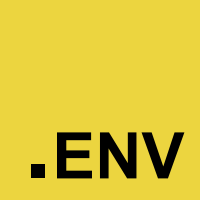

<!--
**Carl-Johnsons/Carl-Johnsons** is a ✨ _special_ ✨ repository because its `README.md` (this file) appears on your GitHub profile.

Here are some ideas to get you started:

- 🔭 I’m currently working on ...
- 🌱 I’m currently learning ...
- 👯 I’m looking to collaborate on ...
- 🤔 I’m looking for help with ...
- 💬 Ask me about ...
- 📫 How to reach me: ...
- 😄 Pronouns: ...
- ⚡ Fun fact: ...
-->
<!-- 
  
 -->

<h2 align="left"
style="
  font-family: 'Orbitron', sans-serif;
  background: linear-gradient(90deg, #5ee6ff, #a259ff);
  background-clip: text;
  -webkit-background-clip: text;
  color: transparent;
  -webkit-text-fill-color: transparent;
  text-shadow: 0 0 6px #6bc3ff;
"
>Main skills:</h2>

  
  

    <!-- Square Particles -->
    

    

    

    

    

    

    

    

    

    

    

    

    

    

    

  

 
  <h4
  style="
    font-family: 'Orbitron', sans-serif;
    background: linear-gradient(90deg, #89f0ff, #d988ff);
    background-clip: text;
    -webkit-background-clip: text;
    color: transparent;
    -webkit-text-fill-color: transparent;
    text-shadow: 0 0 4px #a8e0ff;
  ">Back-end (preferred)</h4>
  

    
    
  

  <h4
  style="
    font-family: 'Orbitron', sans-serif;
    background: linear-gradient(90deg, #89f0ff, #d988ff);
    background-clip: text;
    -webkit-background-clip: text;
    color: transparent;
    -webkit-text-fill-color: transparent;
    text-shadow: 0 0 4px #a8e0ff;
  ">Front-end:</h4>
  

    
  
  

  <h4
  style="
    font-family: 'Orbitron', sans-serif;
    background: linear-gradient(90deg, #89f0ff, #d988ff);
    background-clip: text;
    -webkit-background-clip: text;
    color: transparent;
    -webkit-text-fill-color: transparent;
    text-shadow: 0 0 4px #a8e0ff;
  "
  >DevOps:</h4>
  

  
  
  
  
  
  

  <h4
  style="
    font-family: 'Orbitron', sans-serif;
    background: linear-gradient(90deg, #89f0ff, #d988ff);
    background-clip: text;
    -webkit-background-clip: text;
    color: transparent;
    -webkit-text-fill-color: transparent;
    text-shadow: 0 0 4px #a8e0ff;
  "
  >Database:</h4>
  

  
  
  
  

<h2 align="left"
style="
  font-family: 'Orbitron', sans-serif;
  background: linear-gradient(90deg, #5ee6ff, #a259ff);
  background-clip: text;
  -webkit-background-clip: text;
  color: transparent;
  -webkit-text-fill-color: transparent;
  text-shadow: 0 0 6px #6bc3ff;
"
>Cool-looking achievements 🔥:</h2>

 

<h2
  style="
    font-family: 'Orbitron', sans-serif;
    background: linear-gradient(90deg, #89f0ff, #d988ff);
    background-clip: text;
    -webkit-background-clip: text;
    color: transparent;
    -webkit-text-fill-color: transparent;
    text-shadow: 0 0 4px #a8e0ff;
  "
>How to reach me:</h2>

- 📫 **ducnlt.it@gmail.com**
- 📫 [Linkedln](https://www.linkedin.com/in/nguy%E1%BB%85n-l%C3%AA-t%C3%A0i-%C4%91%E1%BB%A9c-92a790305/)
